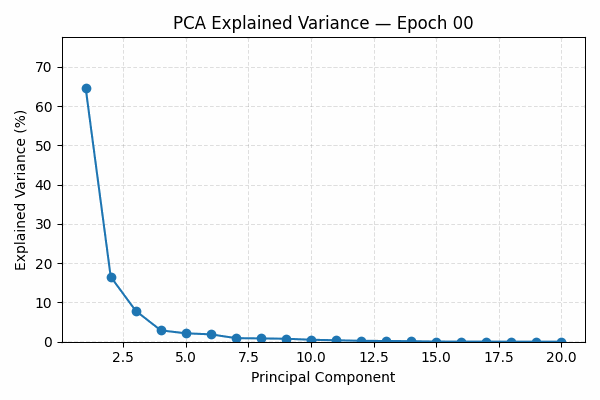

# Spectral Frontend: Structured Autoencoder for Downstream Sequence Modeling

This repository implements a convolutional autoencoder designed not just for dimensionality reduction, but for shaping a **structured, information-rich latent space**. This latent space is specifically crafted to serve as the **frontend** to a downstream **Conformer encoder** and ultimately a **large language model (LLM)**.

The model is trained and evaluated with metrics and visualizations rooted in the **Information Bottleneck (IB) principle**, aiming to extract a latent representation that is both compact (`I(Z;X)`) and relevant (`I(Z;Y)`).

---

## 📂 Repository Structure

```
spectral_frontend/
├── configs/ # YAML configuration files and parser
├── eval/ # Analysis and visualization scripts
├── models/ # Variants of convolutional autoencoder models
├── results/ # Training visualizations and latent space diagnostics
├── train/ # Training scripts and utilities (single-GPU and DDP)
├── LICENSE # License file
└── README.md # This document
```

---

## Key Features

### Latent Structure-Aware Design

- **Compression is not the sole goal** — this autoencoder seeks to **structure** the latent space in preparation for sequence models.
- Trained with the **Information Bottleneck framework** in mind.
- Useful for **audio**, **time-series**, or **representation learning** where structured latent manifolds are beneficial.

---

## Training Diagnostics

This project goes beyond loss curves and introduces meaningful diagnostics to monitor **information flow** and **latent geometry**:

---

### 1. Latent Entropy Over Epochs


Early training shows a sharp decrease in entropy (`I(Z;X)`), reflecting compression. A later plateau indicates the onset of **structured representation learning**, where noise is removed while task-relevant features are retained.

---

### 📈 2. PCA Explained Variance



This plot shows the distribution of variance across principal components. The steep initial drop illustrates that the latent space collapses onto a **low-dimensional manifold** — key for feeding into attention-based models like the Conformer.

---

### 3. PCA Scatter Overlay


Overlaid PCA projections show how distinct principal component axes shape the latent cloud. The non-linear clustering pattern reveals the emergence of a **manifold**, rather than an unstructured cloud, in the latent space.

This supports the hypothesis that **meaningful geometry** is being formed during training, which is crucial for downstream sequence modeling.

---

###  4. Latent Variance Over Epochs


Different dimensions activate and stabilize at different rates. The model converges on a **subset of informative latent dimensions**, another sign of compact yet relevant representation.

---

### 5. Proxy for I(Z;Y): R² Score


We approximate mutual information `I(Z;Y)` via R² scores over local windows. Despite entropy reduction, the high R² score shows that **task-relevant information is preserved**.

---

### 6. Information Bottleneck Curve


This plot captures the full **Information Bottleneck training dynamic**:

- **Leftward Movement**: Early training reduces entropy (compression).
- **Vertical Stabilization**: Later stages preserve relevance (`I(Z;Y)`), as seen by consistent R² values.
- Color represents training time, from dark (early) to bright (late).

This confirms the two-stage behavior theorized by IB: first **compress**, then **refine**.

---

## Downstream Usage Context

The autoencoder is designed to act as a **frontend** in a hierarchical architecture:

```text
Input Signal ─► Conv-Autoencoder ─► Latent Z ─► Conformer ─► LLM
```

This design ensures that:

- The latent space is **geometrically meaningful**, enabling attention heads in the Conformer to extract useful dependencies.
- The sequence passed to the LLM is **low-dimensional but high-relevance**, suitable for symbolic or generative tasks.
- Compression is **informed by information theory**, rather than just mean squared error.

---

## Installation

Clone the repository and install required packages:

```bash
git clone https://github.com/yourusername/spectral_frontend.git
cd spectral_frontend
pip install -r requirements.txt
```

##  Training

To train a model with default settings:

```bash
python -m train.train_conv_autoencoder --config configs/basic_config.yaml
```

## Evaluation
To generate the training visualizations and metrics shown in the results/ directory:
```bash
python -m eval.training_analyzer 
```

## License
This project is licensed under the MIT License. See the LICENSE file for details.

